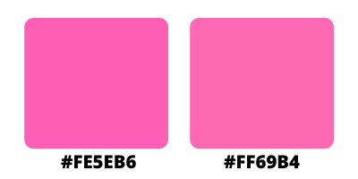

Thirty-four years after its release, **Pretty in Pink** is listed as one of the greatest teen romantic comedies of all times. Everything about it – the plot, the costumes, the soundtrack and so on – still has a great influence on today’s cinema. But what made it this utterly iconic? What element made sure that Pretty in Pink could distinguish itself from the other movies when it first came out? The answer is pretty simple: it was the movie poster, of course – and the **title**.

Let’s start with the font’s ID. You may recognise it as the “**meme font**”, since **Impact** has been one of the most used typefaces for the creation of meme content for the Internet; nevertheless, Impact has been around since 1965, when it was created by Geoffrey Lee for the English engineering company *Stephenson Blake*.

![One of the popular memes where Impact was used [credit: cheezburger.com]](../uploads/progetto-senza-titolo-2-.png)

As the name suggests, Impact was designed as a grotesque font meant to make “**an impact**” on the observer with its strong features like the high x-height, the lack of serifs, and the unique ampersand, which is as tall as the corpus size.

However, this was not enough for the creators of Pretty in Pink, who wanted to make it even **more remarkable**: thus, they used the condensed version of Impact – in bold, with a black background. Completely ground-breaking.

![Pretty in Pink (1984)'s movie poster [credit: imdb]](../uploads/pretty-in-pink.jpg)

With the white words (“Pretty in”) and the black background, the title is coordinated with the black and white filter used for the background picture. On the other hand, the word “pink” is the only coloured feature along with the protagonist’s t-shirt; their alignment creates a **visual effect** that makes them both **stand out** at the same time, therefore fusing them into the first element the observers’ eyes are drawn to.

Pink is the colour associated with **women**, as it is historically considered tender and feminine, and is therefore a “must” in the posters of every romantic comedy. The shades mostly overused in this context are the lightest and more moderate ones, which have a softer effect on the eyes.

However, Pretty in Pink uses a much bolder pink (#FE5EB6), with the nearest shade being **hot pink** (#FF69B4).

Thanks to the high amount of red in this colour, hot pink appears more **vivid** and **playful** than any other typical shade of pink used in romantic comedies and is perfect for the irreverent movie it is being used for, as it is strongly associated with **sexuality** and **femininity**.

The choice of combining **Impact** with a shade of **hot pink**, and along with the distinctive bold, the distinctive black background and the sophisticated and narrowing effect of the condensed letters, certainly does not make this movie poster go unnoticed; on the contrary, it gives Pretty in Pink’s title the **perfect balance** and energy for winning the eyes (and consequently the hearts) of the observers – and is therefore the key to its thirty-four years of **success**.