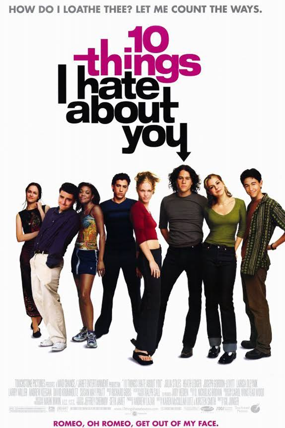

Many people believe that there is nothing fuller of pathos than Shakespeare’s tragedies, and I like to think that they are the same people who have never seen an adaptation of his works set in modern times – in high schools, where the real tragedies happen. I can name a couple of “Shakespeare-approved” masterpieces; however, I believe that we can all agree on which is the superior adaptation – and that is undoubtedly **10 Things I Hate About You**, with a title that is engraved in our midsummer night's dreams.

The tagline is one of the first elements our eyes are attracted to.

It is written in capital letters, and uses Archaic English to make it look like a real quote from Shakespeare. The typeface chosen is a variation in small caps of **Niva** (**Niva Black**), a sans serif designed by Pedro Gonzàlez, founder of PeGGO, with the intention of fusing together **technical and aesthetical features** in order to create the perfect font for every use, from magazines to, like in this case, movie posters.

![Niva Black's family [credit: fontke]](../uploads/360x270.png)