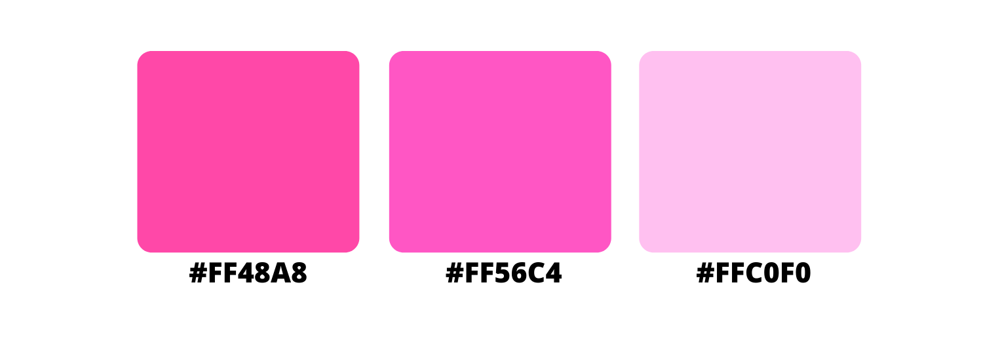

Hello!

My name is Marty, and I am a Media, Journalism and Publishing student at Oxford Brookes University. “**Pretty in Font**” was born as a project for my **Typographic** module, uniting two of my biggest passions: writing, and watching romantic comedies.

In this blog, I analyse some of my favourite movies’ titles, in order to give you as much information as I can about their **fonts**: the history behind them, the colours used, the resulting composition, and so on.

You’ll notice that most of these movies utilise classic fonts, simple imagery, and many shades of pink, so adapting my blog to this **joyful aesthetic** was pretty much binding, not that I’m complaining. I love pink, thus deciding which shades to use for the banners, the logo, and the favicon was definitely my favourite part of this whole project. (see: #**ffc0f0**, #**ff48a8**, and #**ff56c4**), Although I use some other colours and shades for contrast in some banners from time to time, depending on what I feel would suit better the movie in question, I do have some predefined shades:

As pink is “the” colour of rom-coms, it is also the protagonist of this blog. I didn’t just choose pink because it is the colour that women and girls are always associated with; instead, I chose it because it is **vibrant** and **elegant** and harmonious yet strong and decisive, and it perfectly describes the **empowering** and life-changing journeys of the women narrated in the movies whose titles I’m analysing.

I chose **Alegreya** for both the headings and the body text for the same exact reason. Designed by Juan Pablo del Peral for Huerta Tipográfica, this typeface is relatively **recent** yet seems classic enough to pass as a coetaneous of Times New Roman or Palatino Linotype, being used mostly in literature.

![Alegreya Family Font [credit: 1001 fonts]](../uploads/alegreya-font-5-big.png)

In this case, it is a serif(of course), but its family is composed of several versions that go from sans serif to small-caps – and even black 100. Therefore, with its elegant appearance due to the **hefty serifs** and the **dynamic curves** of the letters, Alegreya is perfect for the aesthetic of this blog, since it carries with itself a **global appreciation**, just like the romantic comedies I am using it for.

About my logo, 

With Pretty in Font, my hopes are to share my love for rom-coms and eliminate the stigma attached to them being “chick movies”, so that my readers can discover a new passion and appreciate them at least a bit. In order to do so, I have decided to analyse their titles, since they are just like **business card**: they are vital for understanding the people (or the movie, in this case) behind them, and they summarise their **values** in a symbolic and implicit way, through the choices of fonts and imagery and colours.